# Conceptual Guide: CNN and Vision Transformer Architectures

This companion report to the literature review provides visual, diagrammatic explanations of the core architectures compared in the ViT-vs-CNN literature. The goal is to build intuition for *how* each architecture processes an image, *where* their inductive biases come from, and *why* these structural differences drive the data-efficiency gap discussed in the main report.

---

## 1. The CNN Pipeline

A convolutional neural network processes an image through a hierarchy of stages. Each stage applies local filters (convolutions) followed by spatial downsampling (pooling or strided convolutions), progressively building from low-level features (edges, textures) to high-level features (object parts, scenes).

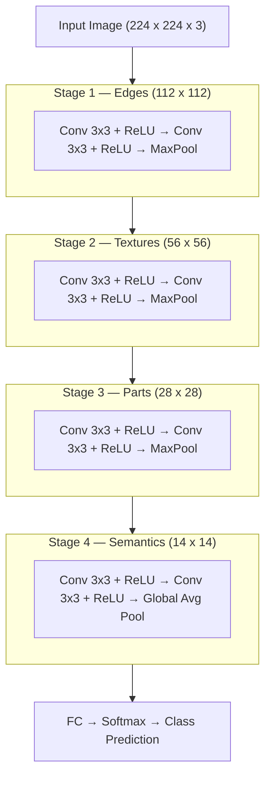

**Key properties:**
- **Locality**: Each convolution filter sees only a small spatial region (e.g. 3x3 pixels). The network's "view" of the image grows gradually through stacked layers — this is the *receptive field*.
- **Translation equivariance**: The same filter is applied at every spatial position. A cat in the top-left produces the same feature activations as a cat in the bottom-right, just shifted in the feature map.
- **Hierarchical processing**: Early layers detect edges and textures; middle layers combine these into parts; later layers recognize objects. This is not learned — it is forced by the architecture.

### 1.1 The Convolution Operation

The fundamental building block. A small filter slides across the input, computing a dot product at each position. The output is a feature map where each value represents the presence of a local pattern.

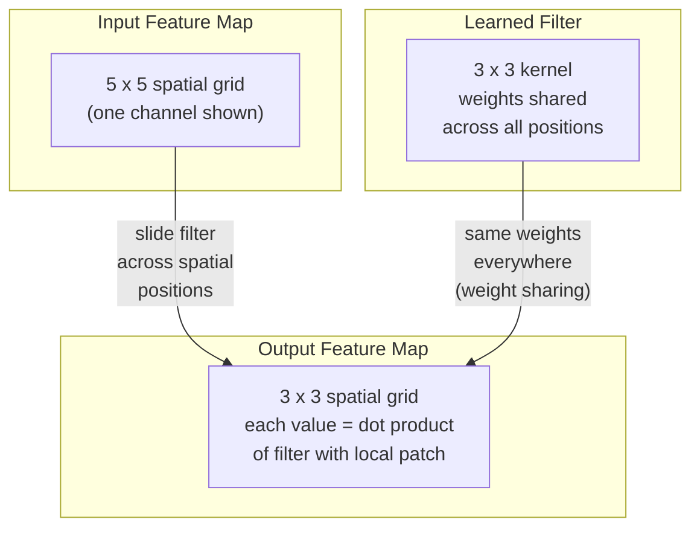

Weight sharing is the source of both **parameter efficiency** (one 3x3 filter has just 9 weights regardless of image size) and **translation equivariance** (shifting the input shifts the output identically).

### 1.2 ResNet: Skip Connections

ResNet (He et al., 2016) solved the degradation problem in deep networks by introducing skip connections that let gradients flow directly through the network. Instead of learning a mapping H(x), each block learns a *residual* F(x) = H(x) - x, so the output is F(x) + x.

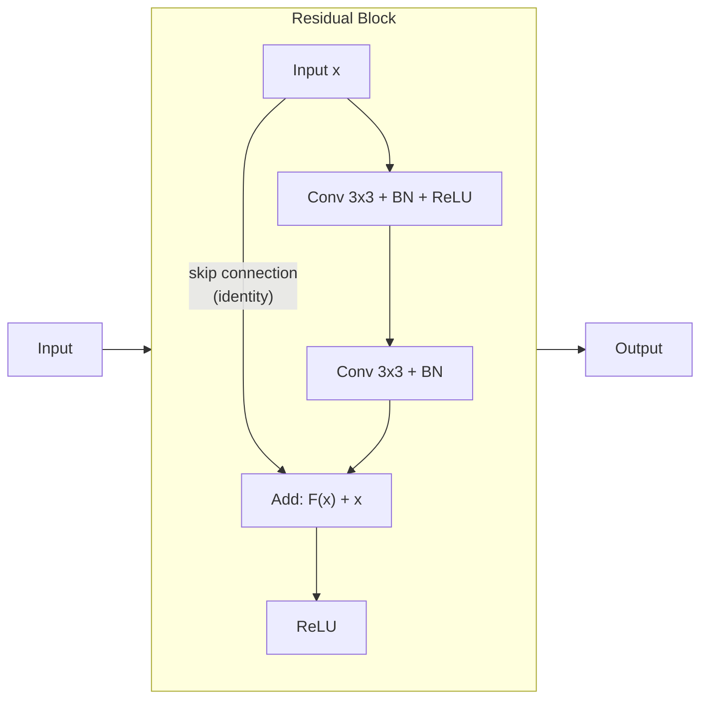

This seemingly simple change is what enabled networks deeper than ~20 layers to train effectively. A ResNet-50 stacks 16 such blocks across 4 stages, with downsampling between stages. The skip connection ensures that even if a block learns nothing useful (F(x) ≈ 0), the signal passes through unchanged — the network can only help, never hurt, by adding depth.

---

## 2. The Vision Transformer (ViT) Pipeline

A Vision Transformer treats an image as a sequence of patches, embeds each patch into a vector, and processes the resulting sequence through a standard transformer encoder. There are no convolutions, no pooling, and no hierarchical stages — just self-attention operating on a flat sequence.

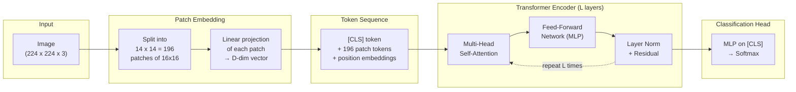

**Key properties:**
- **No locality bias**: Self-attention computes relationships between *all* patch pairs. A patch in the corner can directly attend to a patch at the center. There is no constraint that forces local processing first.
- **No translation equivariance**: Position is encoded through learned embeddings (absolute coordinates), not through shared weights. Moving an object in the image changes its position embeddings.
- **Flat processing**: All layers operate on the same spatial resolution (196 tokens). There is no progressive downsampling or feature hierarchy — the model must learn any hierarchical structure from data.

### 2.1 Patch Embedding in Detail

This is how ViT converts a 2D image into a 1D sequence. The image is divided into a grid of non-overlapping patches, and each patch is linearly projected into the model's embedding dimension.

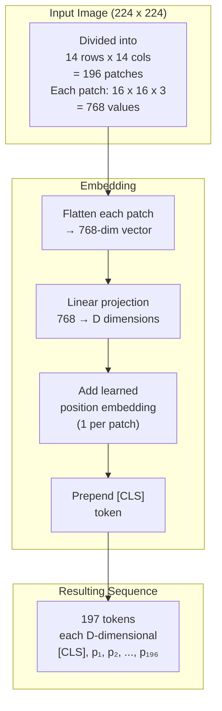

The patchify stem uses a single 16x16 convolution with stride 16 — an aggressive downsampling that discards all sub-patch spatial structure in one step. This is the opposite of CNN design wisdom, where gradual downsampling with small strides is standard. As Xiao et al. (2021) showed, replacing this with a stack of 3x3 convolutions improves optimization stability and accuracy.

### 2.2 Self-Attention: The Core Mechanism

Self-attention is what allows every token to "look at" every other token. For each token, it computes query (Q), key (K), and value (V) vectors, then uses dot-product attention to produce a weighted combination of all values.

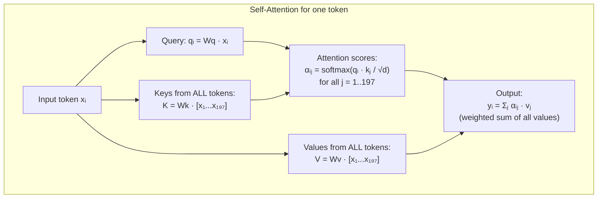

**Multi-head attention** runs H independent attention operations in parallel (each with its own Q, K, V projections), then concatenates and projects the results. This allows different heads to attend to different relationship types — some might learn local attention (nearby patches), others global attention (distant patches).

**Cost**: Self-attention has O(N²) complexity where N is the sequence length. For 196 patches this is manageable; for high-resolution images with thousands of patches, this becomes prohibitive — motivating architectures like Swin Transformer.

### 2.3 A Single Transformer Encoder Block

Each layer of the transformer encoder applies multi-head self-attention followed by a feed-forward network, with layer normalization and residual connections around each.

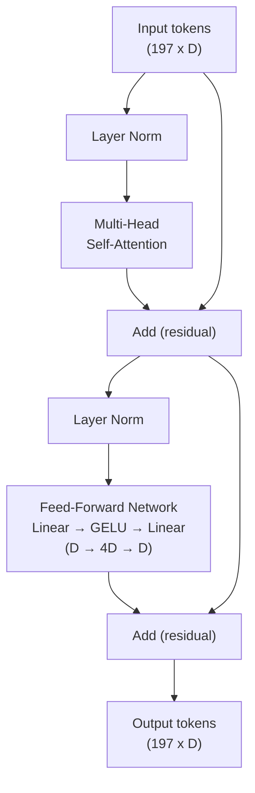

The feed-forward network operates independently on each token (no cross-token interaction). All cross-token communication happens exclusively through self-attention.

---

## 3. CNN vs. ViT: Structural Comparison

The following diagram contrasts how each architecture processes the same input image, highlighting the fundamental structural differences.

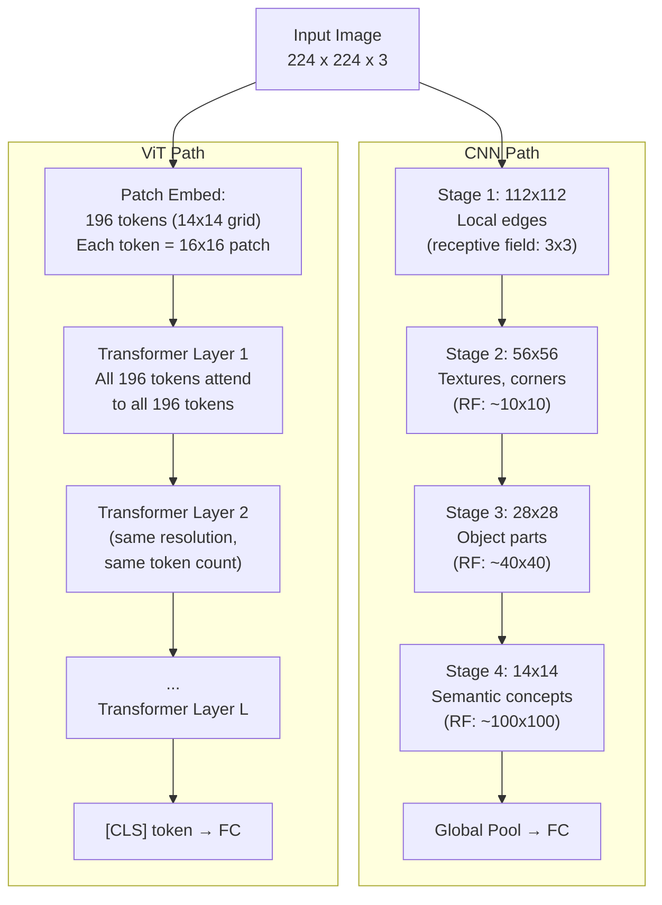

| Property | CNN | ViT |
|---|---|---|
| Spatial processing | Hierarchical (progressive downsampling) | Flat (fixed resolution throughout) |
| Receptive field | Grows gradually across layers | Global from the first layer |
| Locality | Hardcoded (small filters) | Must be learned from data |
| Translation equivariance | Built in (weight sharing) | Absent (learned position embeddings) |
| Parameter sharing | Across spatial positions | Across sequence positions (same attention weights) |
| Complexity in spatial dim | O(N) per layer | O(N²) per layer |
| Inductive bias | Strong (good for small data) | Weak (needs large data or augmentation) |

---

## 4. Swin Transformer: Bridging the Gap

Swin Transformer (Liu et al., 2021) re-introduces two CNN design principles into the transformer framework: **hierarchical feature maps** and **local attention windows**. This makes the architecture more efficient and gives it structural properties closer to a CNN while retaining the benefits of self-attention.

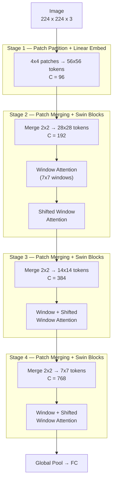

### 4.1 Windowed and Shifted Window Attention

Instead of computing attention among all tokens (O(N²)), Swin restricts attention to local windows. To allow cross-window information flow, consecutive transformer blocks alternate between regular and shifted window partitions.

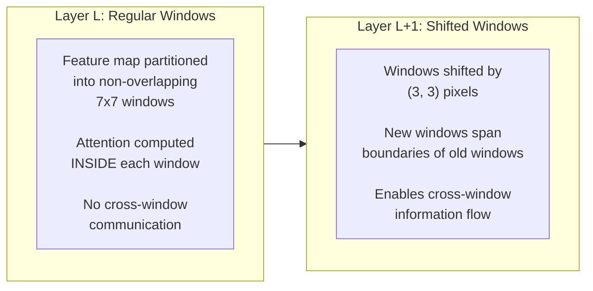

This alternation gives Swin a growing effective receptive field across layers (similar to stacked CNN layers) while keeping the computational cost linear in image size rather than quadratic.

---

## 5. Hybrid Architectures: CoAtNet

CoAtNet (Dai et al., 2021) directly stacks convolutional stages and transformer stages in a single architecture. The principle: use convolution early (where locality bias helps most and spatial resolution is highest) and attention later (where global reasoning is needed and the token count is smaller).

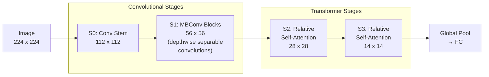

CoAtNet's C-C-T-T configuration works well across data regimes:
- **Small data** (ImageNet-1K): The convolutional stages provide inductive bias where it matters most — early spatial processing — while the transformer stages add capacity.
- **Large data** (JFT-300M): The transformer stages benefit from the additional data in ways that convolution stages cannot, since attention can learn arbitrarily complex spatial relationships.

The result: CoAtNet matched ViT-Huge pre-trained on JFT-300M (300M images) using only ImageNet-21K pre-training (14M images) — 23x less data.

---

## 6. Why ViTs Fail on Small Data: Visual Explanation

This diagram illustrates the core mechanistic finding from Raghu et al. (2021): well-trained ViTs learn a mixture of local and global attention in their lower layers, but data-starved ViTs fail to develop local attention patterns.

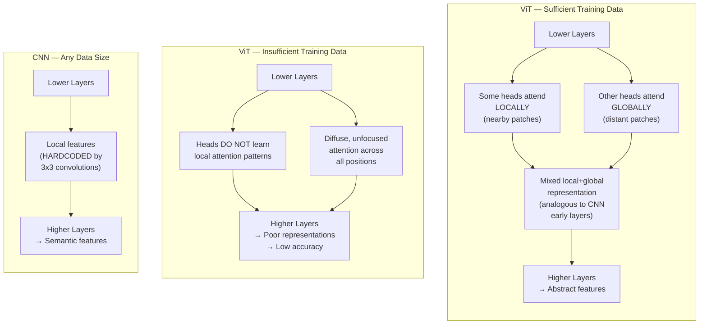

The CNN never faces this failure mode because locality is an architectural constraint, not a learned behavior. This is the fundamental source of the CNN's data-efficiency advantage.

---

## 7. The Spectrum of Inductive Bias

Across the architectures in the literature, there is a spectrum from strong inductive bias (CNNs) to weak inductive bias (vanilla ViT), with various hybrid and modified designs in between.

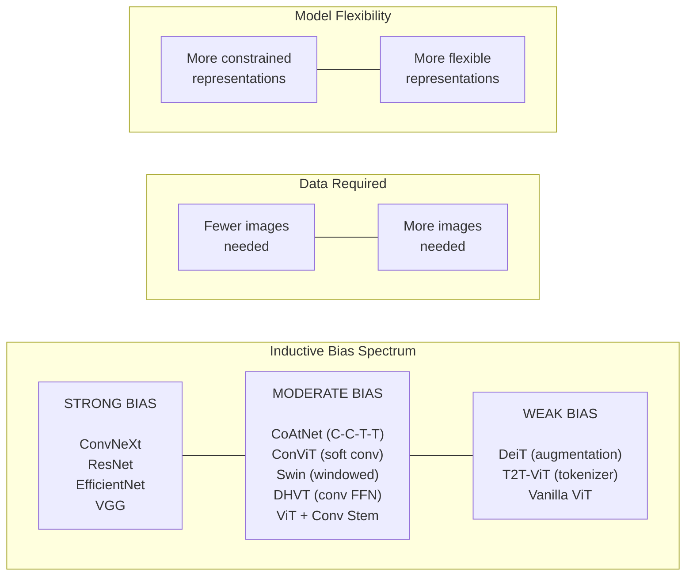

The tradeoff: stronger bias means less data is needed to learn good representations, but the model is more constrained in what it can represent. Weaker bias means the model can potentially learn richer representations, but only if given enough data to discover the right structure.

For a small dataset like PASCAL VOC (~11K images), architectures toward the left of this spectrum (strong bias) will generalize better. As dataset size increases into the millions, architectures toward the right (weak bias) can leverage their flexibility to surpass the constrained models.

---

## 8. Summary: Architecture Selection for Our Project

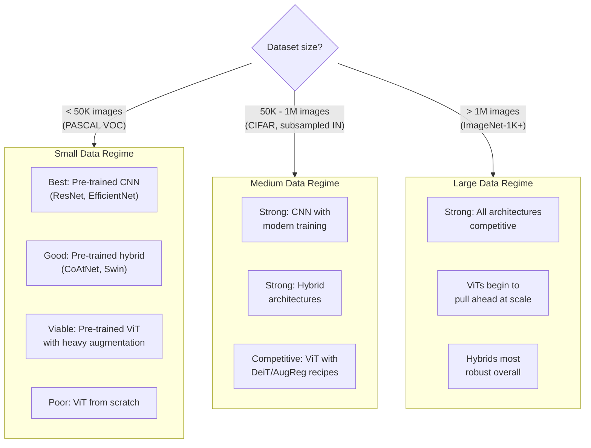

For our PASCAL VOC experiments, we sit firmly in the small-data regime. The literature points to pre-trained CNNs as the strongest baselines, with pre-trained hybrids and augmented ViTs as viable comparison points — and pure ViTs from scratch as the expected low performer that demonstrates the data-efficiency gap.
